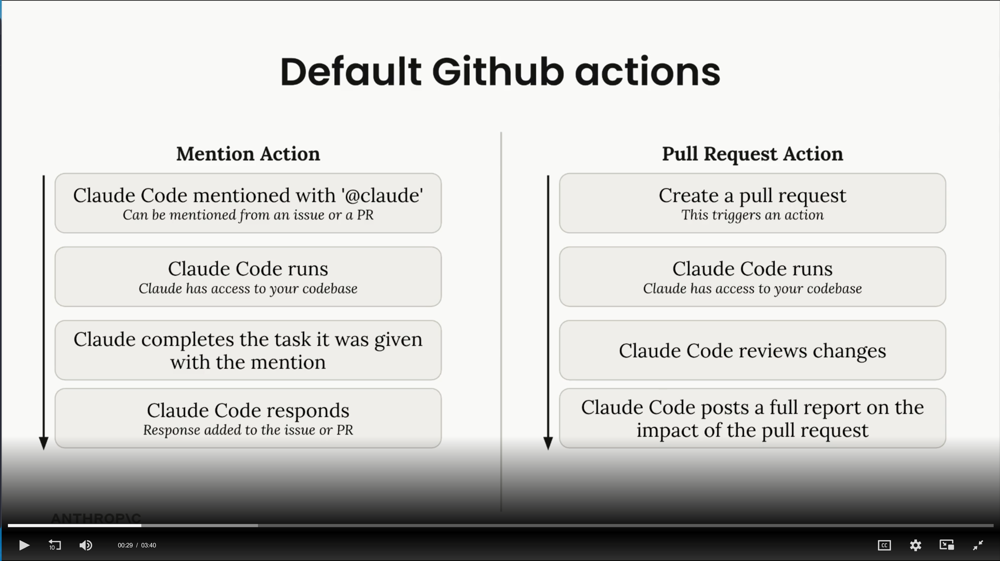

# Lección 11 — GitHub integration

**Sección:** Getting hands on

## ¿Qué es?
Claude Code tiene una integración oficial con GitHub que permite ejecutarse dentro de **GitHub Actions**.

## Setup
Corre el comando dentro de Claude Code:
```
/install GitHub app
```
Esto guía el proceso paso a paso:
1. Instala la app de Claude Code en GitHub
2. Agrega una API key
3. Genera automáticamente un PR con dos GitHub Actions

## Las dos Actions por defecto



**Mention Action** — se activa cuando mencionas `@claude` desde un issue o PR:

```
@claude mencionado  →  Claude Code corre (accede al codebase)
→  Completa la tarea  →  Responde en el mismo issue o PR
```

**Pull Request Action** — se activa cuando se crea un PR:

```
PR creado  →  Claude Code corre (accede al codebase)
→  Revisa los cambios  →  Publica un reporte completo del impacto del PR
```

## Personalización
En `.github/workflows/` puedes agregar instrucciones personalizadas, por ejemplo:
```
El servidor de desarrollo ya está corriendo. Puedes usar el servidor
Playwright MCP para acceder a la app en el browser.
```

## Permisos — punto importante
Cuando Claude Code corre dentro de una Action, **debes listar explícitamente todos los permisos** que quieres otorgarle. Si usas un MCP server, debes listar individualmente cada herramienta que quieres permitir.

## Flujo de prueba
1. Actualiza la configuración → commit + push
2. Crea un issue
3. Menciona a `@Claude` con una tarea específica
4. Claude Code ejecuta la tarea dentro de la Action
